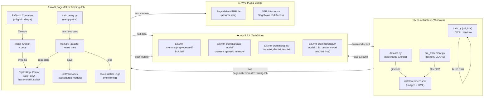
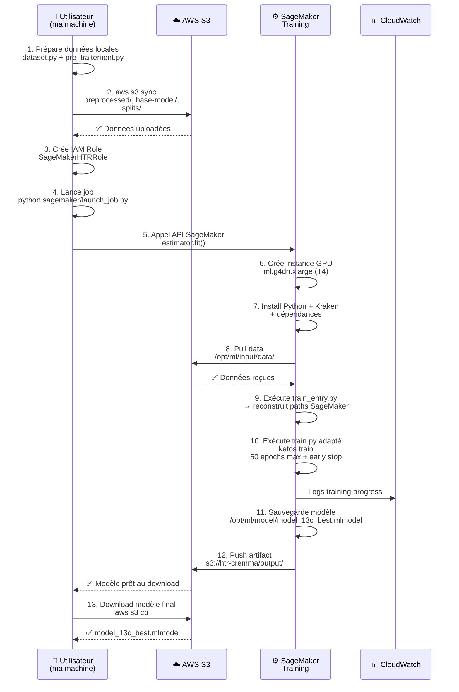

# Architecture HTR sur AWS SageMaker — Guide complet

## Table des matières
1. [Vue d'ensemble](#vue-densemble)
2. [Schéma d'architecture](#schéma-darchitecture)
3. [Flux de données](#flux-de-données)
4. [Composants détaillés](#composants-détaillés)
5. [Variables d'environnement SageMaker](#variables-denvironnement-sagemaker)
6. [Étapes d'implémentation](#étapes-dimplémentation)
7. [Coûts et performances](#coûts-et-performances)

---

## Vue d'ensemble

### Objectif
Fine-tuner le modèle CREMMA Generic (Kraken/HTR) sur des manuscrits médiévaux (XIIe-XIIIe siècles, latin + vieux français) en utilisant AWS SageMaker pour le calcul GPU, tout en stockant les données sur S3.

### Aujourd'hui (avant)
```
Mon ordinateur
├── dataset.py ──────────→ clone dépôts GitHub → data/dataset/
├── pre_traitement.py ───→ deskew/CLAHE/denoise → data/preprocessed/
└── train.py ────────────→ Kraken local ────────→ models/model_13c_best.mlmodel
                          (CPU lent, pas scalable)
```

### Après (avec SageMaker)
```
Mon ordinateur              AWS Account (TechTribe)
                           │
├─ sagemaker/             ├─ S3 Bucket
│  ├─ train_entry.py ────→│  ├─ preprocessed/ (images + XML)
│  ├─ launch_job.py       │  ├─ base-model/ (CREMMA.mlmodel)
│  └─ trust-policy.json   │  └─ splits/ (train/dev/test.txt)
                          │
└─ data/preprocessed/     ├─ SageMaker Training Job
   (sync vers S3)         │  ├─ Instance GPU (ml.g4dn.xlarge)
                          │  ├─ Install Kraken + dépendances
                          │  ├─ Read data from /opt/ml/input/data/
                          │  ├─ Run train.py (ketos train)
                          │  └─ Save model → /opt/ml/model/
                          │
                          └─ CloudWatch Logs
                             (monitoring + debugging)
```

---

## Schéma d'architecture

### Vue complète (Mermaid)



### Flux détaillé (étape par étape)



---

## Flux de données

### Avant (local)

```
GitHub Repos
   ↓ git clone (dataset.py)
data/dataset/
   ├── fro/
   │   ├── BnF_fr_412/
   │   │   ├── page001.xml
   │   │   └── page001.jpg
   │   └── ...
   └── lat/ ...
   
   ↓ OpenCV (pre_traitement.py)
   
data/preprocessed/
   ├── fro/
   │   ├── BnF_fr_412/
   │   │   ├── page001.xml (copié)
   │   │   └── page001.jpg (deskew + CLAHE + denoise)
   │   └── ...
   └── lat/ ...
   
   ↓ construire_split() (train.py)
   
data/splits/
   ├── split_lock.json (SHA256 hash pour reproducibilité)
   ├── train.txt (liste chemins XML train)
   ├── dev.txt (liste chemins XML dev)
   └── test.txt (liste chemins XML test)
   
   Exemple train.txt :
   C:\Users\djame\...\data\preprocessed\fro\BnF_fr_412\page001.xml
   C:\Users\djame\...\data\preprocessed\fro\BnF_fr_412\page002.xml
   ...
   
   ↓ ketos train (train.py)
   
models/
   └── model_13c_best.mlmodel
       (fine-tuned CREMMA)
```

### Après (SageMaker)

```
S3://htr-cremma-medieval/
├── preprocessed/
│   ├── fro/
│   │   ├── BnF_fr_412/
│   │   │   ├── page001.xml
│   │   │   └── page001.jpg
│   │   └── ...
│   └── lat/ ...
│
├── base-model/
│   └── cremma_generic.mlmodel
│       (téléchargé depuis Zenodo une fois, gardé en S3)
│
├── splits/
│   ├── split_lock.json
│   ├── train.txt
│   ├── dev.txt
│   └── test.txt
│
└── output/ (créé par SageMaker)
    └── model_13c_best.mlmodel
        (résultat de l'entraînement)
```

### Montage SageMaker (inside container)

```
/opt/ml/
├── input/
│   ├── config/
│   │   ├── hyperparameters.json
│   │   └── inputdataconfig.json
│   └── data/
│       ├── train/          ← s3://htr-cremma/preprocessed/fro/
│       │   ├── BnF_fr_412/
│       │   │   ├── page001.xml
│       │   │   └── page001.jpg
│       │   └── ...
│       ├── dev/            ← s3://htr-cremma/preprocessed/
│       ├── basemodel/      ← s3://htr-cremma/base-model/
│       │   └── cremma_generic.mlmodel
│       └── splits/         ← s3://htr-cremma/splits/
│           ├── train.txt
│           ├── dev.txt
│           └── test.txt
│
├── model/                  ← output S3 (après job)
│   └── model_13c_best.mlmodel
│       (Kraken sauvegarde ici)
│
├── output/
│   └── (optionnel : logs, rapports)
│
├── code/
│   ├── train_entry.py      ← entry point
│   └── train.py            ← copié du repo
│
└── failures/
    └── (erreurs si job échoue)
```

---

## Composants détaillés

### 1. **train.py** (original → adapté)

#### Problème local
```python
# Chemin local (Windows)
input_dir = "./data/preprocessed"
models_dir = "./models"

# train.txt contient des chemins absolus Windows
# C:\Users\djame\...\data\preprocessed\fro\BnF_fr_412\page001.xml
```

#### Solution SageMaker
```python
# Détection environnement
SM_CHANNEL_TRAIN = os.environ.get("SM_CHANNEL_TRAIN")      # /opt/ml/input/data/train
SM_CHANNEL_DEV = os.environ.get("SM_CHANNEL_DEV")          # /opt/ml/input/data/dev
SM_CHANNEL_BASEMODEL = os.environ.get("SM_CHANNEL_BASEMODEL")
SM_MODEL_DIR = os.environ.get("SM_MODEL_DIR", "./models")  # /opt/ml/model

if SM_CHANNEL_TRAIN:
    # Mode SageMaker → utiliser chemins container
    input_dir = SM_CHANNEL_TRAIN
    models_dir = SM_MODEL_DIR
else:
    # Mode local → chemins relatifs
    input_dir = "./data/preprocessed"
    models_dir = "./models"
```

#### Changements dans `train.py`
| Section | Avant (local) | Après (SageMaker) |
|---------|---------------|-------------------|
| **Path inputs** | `args.input` (./data/preprocessed) | `SM_CHANNEL_TRAIN` (/opt/ml/input/data/train) |
| **Path outputs** | `args.models_dir` (./models) | `SM_MODEL_DIR` (/opt/ml/model) |
| **Télécharge base model** | Zenodo (chaque run) | S3 via `SM_CHANNEL_BASEMODEL` (une fois) |
| **Construire split** | Depuis local, crée train.txt | Lit train.txt depuis S3 |
| **Workarounds Windows** | `if os.name == "nt": workers=0` | Supprimé (Linux SageMaker) |

### 2. **train_entry.py** (nouveau)

```python
#!/usr/bin/env python3
"""
Entry point pour SageMaker.
Lance train.py avec les chemins/variables SageMaker correctes.
"""
import os
import sys
import subprocess
import json
from pathlib import Path

def main():
    # Lire variables d'environnement SageMaker
    sm_train_data = os.environ.get("SM_CHANNEL_TRAIN", "/opt/ml/input/data/train")
    sm_model_dir = os.environ.get("SM_MODEL_DIR", "/opt/ml/model")
    sm_splits = os.environ.get("SM_CHANNEL_SPLITS", "/opt/ml/input/data/splits")
    
    # Lire hyperparameters.json (passés via estimator)
    hp_file = "/opt/ml/input/config/hyperparameters.json"
    hyperparameters = {}
    if Path(hp_file).exists():
        with open(hp_file) as f:
            hyperparameters = json.load(f)
    
    # Construire la commande train.py
    cmd = [
        sys.executable, "train.py",
        "--input", sm_train_data,
        "--models-dir", sm_model_dir,
        "--splits-dir", sm_splits,
        "--lr", hyperparameters.get("lr", "1e-4"),
        "--batch-size", hyperparameters.get("batch-size", "16"),
        "--max-epochs", hyperparameters.get("max-epochs", "50"),
    ]
    
    print(f"[SageMaker] Lancement : {' '.join(cmd)}")
    result = subprocess.run(cmd, check=True)
    return result.returncode

if __name__ == "__main__":
    sys.exit(main())
```

**Rôle :** Intermédiaire qui lit les variables SageMaker et les passe à `train.py` avec les chemins corrects.

### 3. **launch_job.py** (nouveau)

```python
#!/usr/bin/env python3
"""
Script pour lancer un job SageMaker depuis la CLI.
"""
import sagemaker
from sagemaker.pytorch import PyTorch
from sagemaker.estimator import Estimator
import boto3

def launch_training_job(
    bucket_name="htr-cremma-medieval",
    instance_type="ml.g4dn.xlarge",
    instance_count=1,
    lr=1e-4,
    batch_size=16,
    max_epochs=50,
    role_arn=None,
):
    """
    Lance un job SageMaker de fine-tuning Kraken.
    
    Args:
        bucket_name: Nom du bucket S3 (ex: htr-cremma-medieval)
        instance_type: Type instance (ml.g4dn.xlarge = GPU T4, ~0.75$/h)
        instance_count: Nombre instances (1 pour ce projet)
        lr: Learning rate (défaut: 1e-4)
        batch_size: Batch size (défaut: 16)
        max_epochs: Epochs max (défaut: 50)
        role_arn: ARN du rôle SageMaker (ex: arn:aws:iam::275189446215:role/SageMakerHTRRole)
    """
    
    # Session SageMaker (région eu-west-3, compte TechTribe)
    session = sagemaker.Session()
    
    if not role_arn:
        # Auto-détect rôle (cherche SageMakerHTRRole dans le compte)
        iam = boto3.client("iam")
        roles = iam.list_roles()["Roles"]
        role_arn = next(
            (r["Arn"] for r in roles if "SageMakerHTRRole" in r["RoleName"]),
            None
        )
        if not role_arn:
            raise ValueError("Rôle SageMakerHTRRole non trouvé. Créez-le d'abord.")
    
    print(f"Rôle SageMaker : {role_arn}")
    
    # Définir l'estimateur PyTorch
    estimator = PyTorch(
        entry_point="train_entry.py",
        source_dir="sagemaker/",
        role=role_arn,
        instance_type=instance_type,
        instance_count=instance_count,
        
        # Framework
        framework_version="2.4",
        py_version="py311",
        
        # Hyperparameters
        hyperparameters={
            "lr": lr,
            "batch-size": batch_size,
            "max-epochs": max_epochs,
            "lag": 20,
        },
        
        # Requirements
        requirements_file="requirements_sagemaker.txt",
        
        # Output
        output_path=f"s3://{bucket_name}/output/",
        base_job_name="htr-cremma-training",
    )
    
    # Définir les data channels (montés comme /opt/ml/input/data/<channel_name>/)
    training_data = {
        "train": f"s3://{bucket_name}/preprocessed/fro/",
        "dev": f"s3://{bucket_name}/preprocessed/",
        "basemodel": f"s3://{bucket_name}/base-model/",
        "splits": f"s3://{bucket_name}/splits/",
    }
    
    print(f"Data channels :")
    for name, s3_path in training_data.items():
        print(f"  {name} : {s3_path}")
    
    # Lancer le job
    print("\n🚀 Lancement du job SageMaker...")
    estimator.fit(training_data)
    
    print("\n✅ Job lancé avec succès !")
    print(f"Nom du job : {estimator.latest_training_job.name}")
    print(f"Output S3 : s3://{bucket_name}/output/")

if __name__ == "__main__":
    import argparse
    
    parser = argparse.ArgumentParser()
    parser.add_argument("--bucket", default="htr-cremma-medieval", help="Nom bucket S3")
    parser.add_argument("--instance-type", default="ml.g4dn.xlarge", help="Type instance")
    parser.add_argument("--lr", type=float, default=1e-4, help="Learning rate")
    parser.add_argument("--batch-size", type=int, default=16, help="Batch size")
    parser.add_argument("--max-epochs", type=int, default=50, help="Max epochs")
    parser.add_argument("--role", help="ARN rôle SageMaker (auto-détecté si absent)")
    
    args = parser.parse_args()
    
    launch_training_job(
        bucket_name=args.bucket,
        instance_type=args.instance_type,
        lr=args.lr,
        batch_size=args.batch_size,
        max_epochs=args.max_epochs,
        role_arn=args.role,
    )
```

**Rôle :** Orchestrateur qui crée et lance le job SageMaker avec les bons paramètres et data channels.

### 4. **requirements_sagemaker.txt** (nouveau)

```
kraken>=4.3
opencv-python-headless>=4.5
lxml>=4.9
tqdm>=4.64
pyarrow<24
boto3>=1.26
```

**Note :** PyTorch, NumPy, etc. sont **déjà dans le container PyTorch SageMaker**, pas besoin de les lister.

### 5. **trust-policy.json** (nouveau)

```json
{
  "Version": "2012-10-17",
  "Statement": [
    {
      "Effect": "Allow",
      "Principal": {
        "Service": "sagemaker.amazonaws.com"
      },
      "Action": "sts:AssumeRole"
    }
  ]
}
```

**Rôle :** Permet au service SageMaker d'assumer le rôle `SageMakerHTRRole`.

---

## Variables d'environnement SageMaker

SageMaker injecte automatiquement ces variables dans le container :

| Variable | Valeur | Utilisé dans |
|----------|--------|--------------|
| `SM_CHANNEL_TRAIN` | `/opt/ml/input/data/train` | train.py (détection mode SM) |
| `SM_CHANNEL_DEV` | `/opt/ml/input/data/dev` | train.py |
| `SM_CHANNEL_BASEMODEL` | `/opt/ml/input/data/basemodel` | train.py |
| `SM_CHANNEL_SPLITS` | `/opt/ml/input/data/splits` | train.py |
| `SM_MODEL_DIR` | `/opt/ml/model` | train.py (output modèle) |
| `SM_NUM_GPUS` | `1` | (auto, Kraken le détecte) |
| `SM_HYPERPARAMETERS` | `/opt/ml/input/config/hyperparameters.json` | train_entry.py |
| `AWS_REGION` | `eu-west-3` | (optionnel, boto3) |

---

## Étapes d'implémentation

### Phase 1 : Préparer les données localement

```bash
# 1. Clone le repo
git clone <repo> && cd htr-cremma-medieval-2026

# 2. Télécharger + assembler le dataset (si pas déjà fait)
python dataset.py

# 3. Prétraiter les images (deskew, CLAHE)
python pre_traitement.py

# 4. Vérifier le résultat
ls data/preprocessed/  # fro/, lat/
ls data/splits/        # split_lock.json, train.txt, dev.txt, test.txt
```

### Phase 2 : Créer l'infrastructure AWS

```bash
# 1. Créer le bucket S3
aws s3 mb s3://htr-cremma-medieval \
  --region eu-west-3 \
  --profile techtribe_root

# 2. Activer le versioning (optionnel mais recommandé)
aws s3api put-bucket-versioning \
  --bucket htr-cremma-medieval \
  --versioning-configuration Status=Enabled \
  --profile techtribe_root

# 3. Créer le rôle IAM SageMaker
aws iam create-role \
  --role-name SageMakerHTRRole \
  --assume-role-policy-document file://sagemaker/trust-policy.json \
  --profile techtribe_root

# 4. Attacher les permissions S3 + SageMaker
aws iam attach-role-policy \
  --role-name SageMakerHTRRole \
  --policy-arn arn:aws:iam::aws:policy/AmazonS3FullAccess \
  --profile techtribe_root

aws iam attach-role-policy \
  --role-name SageMakerHTRRole \
  --policy-arn arn:aws:iam::aws:policy/AmazonSageMakerFullAccess \
  --profile techtribe_root
```

### Phase 3 : Uploader les données S3

```bash
# Images + XML pré-traités (PRIORITAIRE)
aws s3 sync data/preprocessed/ \
  s3://htr-cremma-medieval/preprocessed/ \
  --profile techtribe_root \
  --region eu-west-3

# Modèle de base CREMMA
aws s3 cp models/cremma_generic.mlmodel \
  s3://htr-cremma-medieval/base-model/ \
  --profile techtribe_root

# Fichiers de split
aws s3 sync data/splits/ \
  s3://htr-cremma-medieval/splits/ \
  --profile techtribe_root

# Vérifier
aws s3 ls s3://htr-cremma-medieval/ \
  --recursive --profile techtribe_root
```

### Phase 4 : Adapter le code pour SageMaker

**Fichiers à créer :**
1. `sagemaker/train_entry.py`
2. `sagemaker/launch_job.py`
3. `sagemaker/trust-policy.json`
4. `requirements_sagemaker.txt`

**Fichiers à modifier :**
1. `train.py` — ajouter détection env SageMaker (voir section Composants)

### Phase 5 : Lancer le job

```bash
# Option 1 : Via Python (recommandé)
python sagemaker/launch_job.py \
  --bucket htr-cremma-medieval \
  --instance-type ml.g4dn.xlarge \
  --lr 1e-4 \
  --batch-size 16 \
  --max-epochs 50

# Option 2 : Via AWS CLI (manuel)
# (voir documentation SageMaker CreateTrainingJob)
```

### Phase 6 : Monitoring + Résultats

```bash
# Voir les logs (CloudWatch)
aws logs tail /aws/sagemaker/TrainingJobs/<job-name> \
  --profile techtribe_root \
  --follow

# Lister les jobs lancés
aws sagemaker list-training-jobs \
  --region eu-west-3 \
  --profile techtribe_root

# Récupérer le modèle final
aws s3 cp s3://htr-cremma-medieval/output/model/ . \
  --recursive \
  --profile techtribe_root

# Télécharger un seul fichier
aws s3 cp \
  s3://htr-cremma-medieval/output/model/model_13c_best.mlmodel \
  ./model_13c_best.mlmodel \
  --profile techtribe_root
```

---

## Coûts et performances

### Estimation de coût par run

| Composant | Quantité | Prix/unité | Coût total |
|-----------|----------|------------|------------|
| **ml.g4dn.xlarge** | 2h en moyenne | 0.75 $/h (eu-west-3) | ~1.50 $ |
| **S3 storage** (5 GB) | 1 mois | 0.023 $/GB | ~0.12 $ |
| **Data transfer** (S3 → EC2) | 5 GB | Gratuit (même région) | 0 $ |
| **CloudWatch logs** | ~500 MB | 0.50 $/GB | ~0.25 $ |
| **Total par run** | — | — | **~1.87 $** |

### Timeline d'exécution

| Étape | Durée typique |
|-------|----------------|
| Création instance + setup (install Kraken) | 3–5 min |
| Data pull depuis S3 (5 GB) | 2–3 min |
| Compilation dataset Arrow (si nécessaire) | 5–10 min |
| **Entraînement** | 20–30 min (20 epochs + early stop) |
| Sauvegarde + push S3 | 2–3 min |
| **Total** | **35–55 min** |

### Performance GPU vs CPU

| Setup | Temps/epoch | Total 50 epochs |
|-------|------------|-----------------|
| **CPU local** (MacBook/Windows) | ~5–10 min | 250–500 min (4–8h) |
| **GPU T4 (SageMaker)** | 30–60 sec | 25–50 min + early stop (~20 epochs) = 20–30 min |
| **Speedup** | **5–10x** | **10–20x** |

---

## Schéma simplifié (en ASCII)

```
┌─────────────────────────────────────────────────────────────────┐
│                    LOCAL MACHINE (Windows)                      │
│                                                                  │
│  ┌──────────────────┐  ┌──────────────────┐                   │
│  │  dataset.py      │  │ pre_traitement   │                   │
│  │  (clone GitHub)  │  │    (deskew)      │                   │
│  └────────┬─────────┘  └────────┬─────────┘                   │
│           │                     │                              │
│           └────────┬────────────┘                              │
│                    │                                           │
│           ┌────────▼─────────┐                                │
│           │ data/preprocessed│                                │
│           │  (images + XML)  │                                │
│           └────────┬─────────┘                                │
│                    │                                           │
│    ┌───────────────┴───────────────┐                          │
│    │  aws s3 sync (upload)         │                          │
│    └───────────────┬───────────────┘                          │
└────────────────────┼──────────────────────────────────────────┘
                     │
┌────────────────────▼──────────────────────────────────────────┐
│                    AWS ACCOUNT (TechTribe)                     │
│                                                                │
│  ┌──────────────────────────────────────────────────────────┐│
│  │                    S3 Bucket                             ││
│  │  htr-cremma-medieval/                                   ││
│  │  ├── preprocessed/ (images + XML)                       ││
│  │  ├── base-model/ (CREMMA.mlmodel)                       ││
│  │  ├── splits/ (train/dev/test.txt)                       ││
│  │  └── output/ ← résultat final                           ││
│  └──────────────┬──────────────────────────────────────────┘│
│                 │                                             │
│                 │ (SageMaker mount)                           │
│                 │                                             │
│  ┌──────────────▼──────────────────────────────────────────┐ │
│  │         SageMaker Training Job (GPU T4)                  │ │
│  │  ml.g4dn.xlarge (0.75 $/h)                              │ │
│  │                                                          │ │
│  │  ┌──────────────────────────────────────────────────┐  │ │
│  │  │ /opt/ml/                                         │  │ │
│  │  │ ├── input/data/                                  │  │ │
│  │  │ │   ├── train/ ← from S3                         │  │ │
│  │  │ │   ├── dev/                                     │  │ │
│  │  │ │   ├── basemodel/                               │  │ │
│  │  │ │   └── splits/                                  │  │ │
│  │  │ │                                                │  │ │
│  │  │ ├── code/                                        │  │ │
│  │  │ │   ├── train_entry.py (entry point)            │  │ │
│  │  │ │   └── train.py (adapté)                        │  │ │
│  │  │ │                                                │  │ │
│  │  │ ├── model/ ← output                              │  │ │
│  │  │ │   └── model_13c_best.mlmodel                   │  │ │
│  │  │ │                                                │  │ │
│  │  │ └── config/                                      │  │ │
│  │  │     └── hyperparameters.json                     │  │ │
│  │  └──────────────────────────────────────────────────┘  │ │
│  │                     │                                    │ │
│  │       ┌─────────────▼─────────────┐                    │ │
│  │       │ ketos train               │                    │ │
│  │       │ 20 epochs + early stop    │                    │ │
│  │       │ CER << 5%                 │                    │ │
│  │       └─────────────┬─────────────┘                    │ │
│  │                     │                                    │ │
│  │        ┌────────────▼────────────┐                     │ │
│  │        │ Push to S3               │                     │ │
│  │        │ /opt/ml/model → S3/out/  │                     │ │
│  │        └────────────┬────────────┘                     │ │
│  └─────────────────────┼────────────────────────────────┘  │
│                        │                                    │
│  ┌──────────────────────▼─────────────────────────────────┐ │
│  │      CloudWatch Logs (monitoring)                      │ │
│  │      - Training progress                               │ │
│  │      - GPU utilization                                 │ │
│  │      - Errors / warnings                               │ │
│  └──────────────────────────────────────────────────────┐ │
│                        │                                  │
└────────────────────────┼──────────────────────────────────┘
                         │
┌────────────────────────▼──────────────────────────────────┐
│              LOCAL MACHINE (Download)                      │
│                                                            │
│  aws s3 cp s3://htr-cremma/output/model_13c_best... .    │
│                                                            │
│  ✅ model_13c_best.mlmodel (ready to use)                │
└────────────────────────────────────────────────────────────┘
```

---

## Résumé décisionnel

### Pourquoi SageMaker (vs. alternatives) ?

| Critère | SageMaker | Alternatives |
|---------|-----------|--------------|
| **Setup** | Simple (Script Mode) | EC2 manuel = complexe |
| **Coût** | Pay-per-use (~1.50$/run) | EC2 always-on = 20–100$/mois |
| **Scalabilité** | Multiplie les instances facilement | Limite à 1 instance |
| **Monitoring** | CloudWatch intégré | Besoin monitoring custom |
| **Intégration** | AWS écosystème (S3, IAM) | Mêmes briques à setup |

### Pourquoi **Script Mode** (vs. BYOC) ?

| Aspect | Script Mode | BYOC |
|--------|------------|------|
| **Setup time** | 10 min | 2h (build Docker) |
| **First run** | ~50 min (install deps) | ~30 min (deps déjà là) |
| **Subsequent runs** | ~50 min (reinstall) | ~30 min (deps cached) |
| **Break-even point** | >10 runs | <10 runs |
| **Recommandation** | ✅ Si <10 runs/mois | Si entraînement fréquent |

---

## Prochaines étapes

1. ✅ Créer le bucket S3 (Étape 1)
2. ✅ Upload données (Étape 2)
3. ✅ Créer rôle IAM (Étape 6)
4. ✅ Adapter train.py (Étape 3)
5. ✅ Créer fichiers sagemaker/ (Étapes 4 & 5)
6. ✅ Lancer le job (Étape 7)
7. ✅ Monitor + récupérer modèle (Étape 8)

**Plan complet dans le fichier plan.md du repo.**
